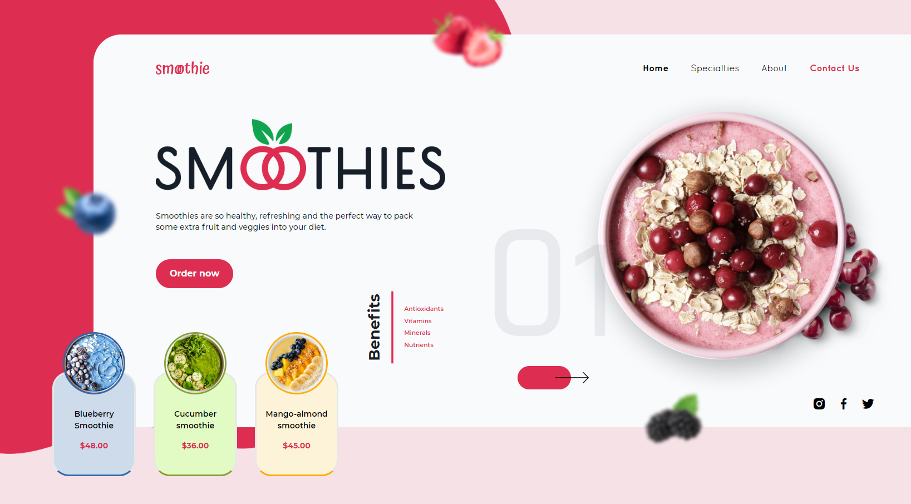

<h1 align="center">
  Smoothie
</h1>

  

  <a href="#-tecnologias">Tecnologias</a>&nbsp;&nbsp;&nbsp;|&nbsp;&nbsp;&nbsp;
  <a href="#-projeto">Projeto</a>&nbsp;&nbsp;&nbsp;|&nbsp;&nbsp;&nbsp;

## 🚀 Tecnologias

Esse projeto foi desenvolvido com as seguintes tecnologias:

- HTML
- [Tailwind CSS](https://tailwindcss.com)

## 🚧 Projeto:

Finalizado

## 🎨 Inspiração:

Figma: https://www.figma.com/file/UNN7VttpUgF37BTRg7ZWIf/Smoothies-%2F-Beverage-Landing-Page-(Community)?node-id=0%3A1

---

Feito com ♥ by Matheusvgdr